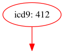

# ConceptQL

ConceptQL (pronounced concept-Q-L) is a high-level language that allows researchers to unambiguously define their research algorithms.

This gem interprets the ConceptQL language and translates it into SQL queries compatible with OMOP CDM-structured data.  The ConceptQL "language" is a set of nested hashes and arrays representing search criteria and some set operations and temporal operations to glue those criteria together.

## Under Active Development
The ConceptQL language is under active development.  If you don't see any activity in the master branch, check the [develop branch](https://github.com/outcomesinsights/conceptql/tree/develop) to see the latest changes to the language.  I try to keep master nice and stable.

## Further Reading

If you're interested in reading up on ConceptQL, a rough draft of the specifications document is [available in markdown format](https://github.com/outcomesinsights/conceptql_spec).

## Motivation for ConceptQL
Outcomes Insights intends to build a vast library of research algorithms and apply those algorithms to large databases of claims data.  Early into building the library, we realized we had to overcome two major issues:

1. Methods sections of research papers commonly use natural language to specify the criteria used to build cohorts from a claims database.
    - Algorithms defined in natural language are often imprecise, open to multiple interpretations, and generally difficult to reproduce.
    - Researchers could benefit from a language that removes the ambiguity of natural language while increasing the reproducibility of their research algorithms.
2. Querying against claims databases is often difficult.
    - Hand-coding algorithms to extract cohorts from datasets is time-consuming, error-prone, and opaque.
    - Researchers could benefit from a language that allows algorithms to be defined at a high-level and then gets translated into the appropriate queries against a database.

We developed ConceptQL to address these two issues.

We are writing a tool that can read research algorithms defined in ConceptQL.  The tool can create a diagram for the algorithm which makes it easy to visualize and understand.  The tool can also translate the algorithm into a SQL query which runs against data structured in [OMOP's Common Data Model (CDM)](http://omop.org/CDM).  The purpose of the CDM is to standardize the format and content of observational data, so standardized applications, tools and methods can be applied to them.

For instance, using ConceptQL we can take a statement that looks like this:
```YAML
:icd9: '412'
```

And generate a diagram that looks like this:



And generate SQL that looks like this:
```SQL
SELECT *
FROM cdm_data.condition_occurrence AS co
JOIN vocabulary.source_to_concept_map AS scm ON (c.condition_concept_id = scm.target_concept_id)
WHERE scm.source_code IN ('412')
AND scm.source_vocabulary_id = 2
AND scm.source_code = co.condition_source_value
```

As stated above, one of the goals of ConcegtQL is to make it easy to assemble fairly complex queries without having to roll up our sleeves and write raw SQL.  To accommodate this complexity, ConceptQL itself has some complexities of its own.  That said, we believe ConceptQL will help researchers define, hone, and share their research algorithms.


## Try Before You Buy

If you'd like to interact with ConceptQL a bit before deciding to dive in, head over to the [ConceptQL Sandbox](http://sandbox.cohortjigsaw.com) for an online demonstration of the language and its features.


## Requirements

ConceptQL is in an early-alpha state.  For now it is limited to working with [OMOP CDM](http://omop.org/CDM)-structured data stored in the [PostgreSQL](http://www.postgresql.org/) database.  It has been tested under [Ubuntu Linux](http://www.ubuntu.com/) and Mac OS X 10.8+.  The interpreter is written in Ruby and theoretically should be platform independent, but your mileage may vary.

Specifically, ConceptQL needs:

- Ruby 2.0+
- PostgresQL 9.3+
- Ruby's [Bundler](http://bundler.io/) gem
- A PostgreSQL database with
    - OMOP CDM-structured data stored in the public schema
    - The OMOP Vocabularies stored in a schema named 'vocabulary'
        - You may want to use [loadmop](http://github.com/outcomesinsights/loadmop) to quickly create the OMOP vocabulary schema

## Installation

Add this line to your application's Gemfile:

    gem 'conceptql'

And then execute:

    $ bundle

Or install it yourself as:

    $ gem install conceptql

## Usage

The easiest way to try out ConceptQL locally is to use the [conceptql-dev-box](http://github.com/outcomesinsights/conceptql-dev-box)

ConceptQL comes with a [Thor](http://whatisthor.com/)-based command-line program: `conceptql`

`conceptql` allows you to translate a ConceptQL statement into a SQL statement or a graph depicting the ConceptQL statement.

`conceptql` will print a basic help menu for each command if you run `conceptql`

See [conceptql-dev-box](http://github.com/outcomesinsights/conceptql-dev-box) for more examples on how to play with ConceptQL

## Writing Your Own ConceptQL

Right now, the only way to create a new ConceptQL statement is to write it out by hand in either Ruby, JSON, or YAML.

If you're feeling bold, feel free to try your hand at authoring a ConceptQL statement.

You might want to just take an existing statement from the statements in [test_conceptql](https://github.com/outcomesinsights/test_conceptql) and modify that.

## Contributing

1. Fork it ( http://github.com/outcomesinsights/conceptql/fork )
2. Create your feature branch (`git checkout -b my-new-feature`)
3. Commit your changes (`git commit -am 'Add some feature'`)
4. Push to the branch (`git push origin my-new-feature`)
5. Create new Pull Request

Or, use the [conceptql-dev-box](https://github.com/outcomesinsights/conceptql-dev-box) to get yourself setup and hack on ConceptQL that way.

## Thanks
- [Outcomes Insights, Inc.](http://outins.com)
    - Many thanks for allowing me to release a portion of my work as Open Source Software!
- [OMOP](http://omop.org)/[OHDSI](http://www.ohdsi.org/)
    - Thank you for providing a great [Common Data Model](http://omop.org/CDM) and fantastic set of standardized [Vocabularies](http://omop.org/Vocabularies) upon which ConceptQL rests.
